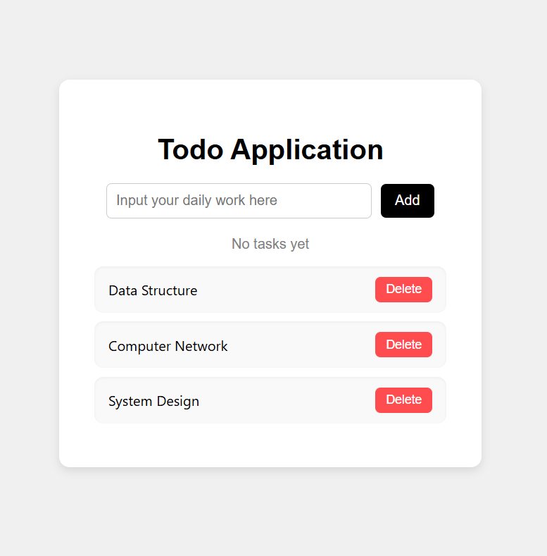
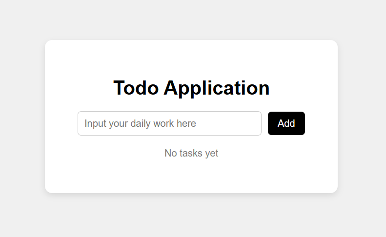

# 📝 Todo App

A simple, elegant, and responsive Todo List application built with **HTML**, **CSS**, and **JavaScript**. It helps users keep track of their daily tasks efficiently and stores the tasks in the browser’s local storage.

---

## 🔗 Live Demo

🌐 [View Live Project](https://nabin2002.github.io/Todo/)

---

## 📌 Features

- Add new tasks
- Mark tasks as completed
- Delete tasks individually
- Responsive user interface
- Tasks are saved in **Local Storage**

---

## 🛠️ Technologies Used

- HTML5
- CSS3
- JavaScript (ES6)

---

## 📂 Folder Structure

``` 
Todo/
├── assets/
│ ├── screenshot1.png
│ └── screenshot2.png
├── index.html
├── style.css
├── script.js
└── README.md
```
---

## 🚀 Getting Started

To run the project locally:

```bash
git clone https://github.com/Nabin2002/Todo.git
cd Todo
open index.html

```

## 📸 Screenshots

### 🖼️ Task Added View


### ✅ Completed Task View


---
## 🙋‍♂️ Author
#### Nabin Chandra Roy